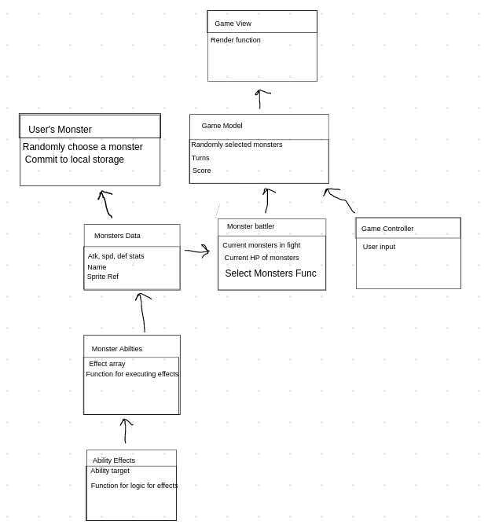

# CF201-Final-Project

## Final Project for Code Fellows 201 class D-62
[Click here to play!](https://niccoryan0.github.io/beast-league/)
### Project Description:

  A pokemon like rpg game that is turn based, where you get a random monster, choose it's name, and fight against others. This would include make constructors for things like the monsters, with methods for things like attacking, choosing randoms for battle, a turn manager to control what monsters spawn, who's turn it is, etc. Pokemon is a hugely popular game series, beloved by many, and the format has become almost ubiquitous for many similarly styled games. We plan to create a new, stripped down version of this format in a browser that has the functionality of Pokemon battles, without the pain of needing to buy a Switch. Our minimum MVP is to have 5 different monsters, each with two abilities and a set HP, three round sets, you pick one monster and battle through three opponents, displaying a score at the end which takes how many HP the player lost and how much damage they inflicted into 

### Team name: Beast League
Members: Nicco Ryan, Ryan Creamer, Babe Habib

## Domain model:

https://awwapp.com/b/up5mxhyyodxl3/#

